# 基于 CMU-CERT r4.2 的内部威胁检测项目研究报告

报告日期：2026-05-26

## 摘要

本项目面向 CMU-CERT r4.2 内部威胁数据集，实现并对比了两类恶意行为识别方法：一类是基于 N-gram 模板的行为序列匹配方法，另一类是基于 R-GCN 的异构图检测方法。前者将登录、设备、文件、HTTP 和邮件等多源日志抽象为用户级行为 token 序列，通过专家模板、N-gram 语言模型异常、恶意签名相似度和群体稀有行为偏离进行融合打分；后者将用户、终端、文件类型和 URL 类别建模为异构图节点，通过关系图卷积网络学习用户节点的恶意概率。

在相同的 1000 名用户、70 名官方恶意用户设定下，R-GCN 在整体指标、Top-K 排查效果和场景级召回上均明显优于 N-gram 方法。R-GCN 全量 OOF ROC-AUC 达到 0.9898，PR-AUC 达到 0.8358，Top-100 命中 69/70 个恶意用户；N-gram 方法对应指标为 ROC-AUC 0.9041、PR-AUC 0.3257、Top-100 命中 37/70。尤其在 S2“求职 + 邮件外发”场景上，R-GCN 的 Top-100 Recall 为 96.67%，显著高于 N-gram 的 16.67%。同时，N-gram 方法仍保留强可解释性和无监督冷启动优势，适合作为规则审计与告警解释模块。

## 1. 研究背景

内部威胁检测不同于普通网络入侵检测。恶意内部人员拥有合法账号和业务访问权限，单个行为往往并不显著异常，风险通常隐藏在跨时间、跨终端、跨资源的一系列行为链中。例如，非工作时间登录、连接 U 盘、访问敏感站点、访问文档文件或外发附件，只有在组合出现时才形成较强的安全含义。

CMU-CERT r4.2 数据集为此类研究提供了较完整的模拟企业日志环境，包含 1000 名员工、约 17 个月日志、70 名红队恶意用户，以及三类典型攻击场景：

| 场景 | 用户数 | 行为概述 |
| --- | ---: | --- |
| S1 | 30 | 离职或不满员工通过 USB、文档访问和泄露站点进行数据外带 |
| S2 | 30 | 即将跳槽员工浏览求职网站、访问资料并通过外部渠道外发 |
| S3 | 10 | 系统管理员访问 keylogger、执行程序并冒用高管身份发送邮件 |

本项目的研究重点是比较“领域知识驱动的序列匹配”和“数据驱动的异构图神经网络”在内部威胁检测中的表现差异，并分析二者在性能、解释性、部署复杂度和适用场景上的取舍。

## 2. 项目实现概览

当前项目的核心文件如下：

| 模块 | 文件 | 作用 |
| --- | --- | --- |
| 数据预处理 | `src/preprocess.py` | 多源日志流式读取、行为 token 化、用户序列构建 |
| 标签构建 | `src/build_ground_truth.py` | CMU-CERT r4.2 官方恶意用户清单 |
| N-gram 方法 | `src/sequence_matching.py` | 四个序列检测器与风险融合 |
| N-gram 训练评估 | `src/train_evaluate.py` | 打分、评估、解释输出 |
| N-gram 可视化 | `src/visualize.py` | 生成序列方法相关图表 |
| R-GCN 图构建 | `src/rgcn/build_graph.py` | 构建用户-终端-文件-URL 异构图 |
| R-GCN 模型 | `src/rgcn/rgcn_model.py` | 纯 PyTorch R-GCN 节点分类模型 |
| R-GCN 训练评估 | `src/rgcn/train_rgcn.py` | 5-fold 训练、OOF 评估和排名输出 |
| 对比分析 | `src/compare_algorithms.py` | 统一计算两种方法指标并生成对比图 |
| 一键流水线 | `src/run_full_pipeline.py` | 串联 N-gram、R-GCN 和对比分析 |

实验输出主要位于：

| 输出目录/文件 | 内容 |
| --- | --- |
| `outputs/metrics.json` | N-gram 方法评估指标 |
| `outputs/risk_scores.csv` | N-gram 全量用户风险分数 |
| `outputs/top_risk_explanations.json` | N-gram Top 风险用户解释 |
| `outputs/rgcn/rgcn_results.json` | R-GCN 指标、交叉验证 AUC、Top-K 和场景召回 |
| `outputs/rgcn/rgcn_results.csv` | R-GCN 全量用户排序 |
| `outputs/comparison/comparison_report.json` | 两种方法统一对比指标 |
| `outputs/comparison/fig_*.png` | 两种方法对比图 |

## 3. 方法一：N-gram 模板行为序列匹配

### 3.1 行为 token 化

N-gram 方法首先将多源日志统一为行为 token 序列。事件被编码为“动作 + 时间段 + 上下文”的形式，例如：

| token | 含义 |
| --- | --- |
| `LOGON_AH_OTHER` | 非工作时间登录非常用 PC |
| `USB_CONN_AH` | 非工作时间连接 USB |
| `FILE_DOC_AH` | 非工作时间访问文档类文件 |
| `HTTP_LEAK_AH` | 非工作时间访问泄露站点 |
| `HTTP_KEYLOG_WH` | 工作时间访问 keylogger 相关站点 |
| `EMAIL_EXT_ATT_WH` | 工作时间向外部邮箱发送附件邮件 |

项目将工作时间定义为周一至周五 07:00-18:00，其余时间为非工作时间。HTTP 日志只保留命中泄露、keylogger、求职等敏感关键词的访问，以降低噪声和存储开销。

### 3.2 四个检测器

N-gram 序列匹配方法由四个互补检测器组成：

| 检测器 | 核心思想 | 输出含义 |
| --- | --- | --- |
| PatternRule | 将红队攻击剧本编码为行为模板，进行窗口内有序子序列匹配 | 是否走完了已知攻击链 |
| NGramAnomaly | 使用良性用户训练 3-gram 语言模型，以 perplexity 衡量异常度 | 行为序列是否偏离正常群体 |
| SequenceSimilarity | 计算用户序列与恶意签名序列的 LCS 相似度，并加权高敏感 token | 整体行为轮廓是否接近恶意样式 |
| PeerDeviation | 对高威胁 token 计算 IDF 加权稀有度 | 是否出现其他用户少见的高风险行为 |

融合公式为：

```text
R(u) = 0.40 * z(rule)
     + 0.20 * z(perplexity)
     + 0.25 * z(similarity)
     + 0.15 * z(peer)
```

### 3.3 N-gram 单方法结果

N-gram 方法在全量 1000 用户上的 ROC-AUC 为 0.9041，PR-AUC 为 0.3257，Top-100 命中 37/70 个恶意用户。该方法对 S1 和 S3 中具有强信号的攻击链较敏感，但对 S2 场景较弱，原因是求职访问和工作时间文档访问在良性用户中也较常见。

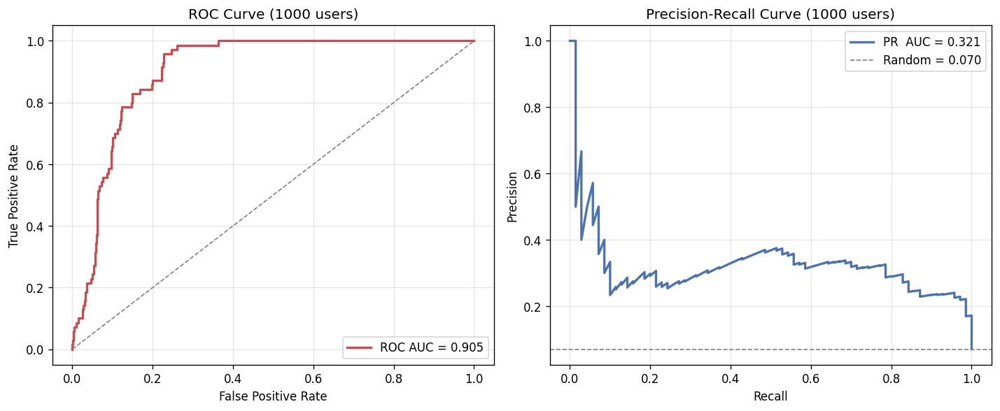

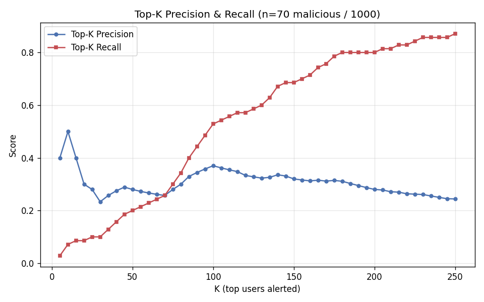

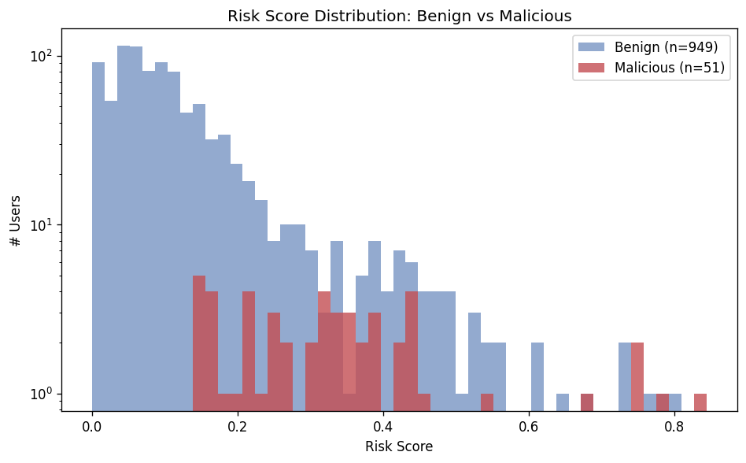

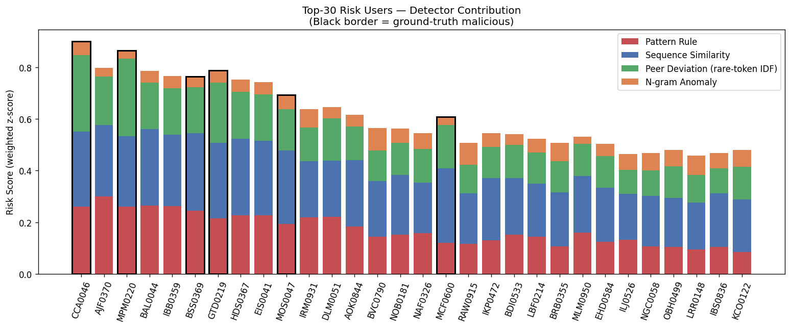

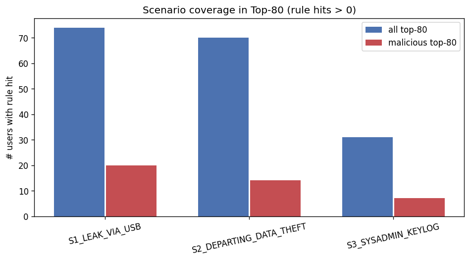

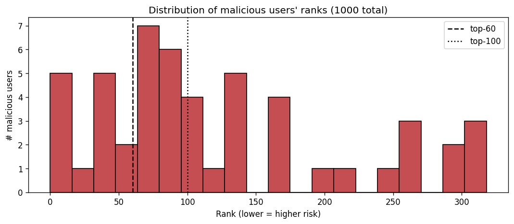

N-gram 方法的优势在于可解释性。每个高风险用户都能追溯到具体规则命中、相似度场景和稀有行为贡献。例如 `top_risk_explanations.json` 中会记录用户命中的场景模板和得分，适合 SOC 分析人员进行人工复核。

## 4. 方法二：R-GCN 异构图检测

### 4.1 建模思路

R-GCN 方法将内部威胁检测建模为异构图上的用户节点二分类任务。与只观察用户个人序列不同，图方法显式利用用户与终端、文件类型、URL 类别之间的关联结构，通过关系图卷积在不同关系上进行消息传递，从而学习更高阶的行为模式。

图构建脚本 `src/rgcn/build_graph.py` 定义了四类节点：

| 节点类型 | 含义 |
| --- | --- |
| user | 员工用户 |
| pc | 终端设备 |
| file_type | 文件类别和时间段组合，如 `doc_WH`、`exec_AH` |
| url_cat | URL 类别和时间段组合，如 `LEAK_AH`、`JOBHUNT_WH` |

图中包含六类原始关系：

| 关系 | 含义 |
| --- | --- |
| `logon_wh` | 用户在工作时间登录 PC |
| `logon_ah` | 用户在非工作时间登录 PC |
| `usb_wh` | 用户在工作时间连接 USB 到 PC |
| `usb_ah` | 用户在非工作时间连接 USB 到 PC |
| `file_op` | 用户访问某类文件 |
| `http_visit` | 用户访问某类 URL |

每条边的权重为 `log(1 + count)`，同一 `(source, target, relation)` 多次出现会合并。训练时自动添加反向边，使信息可以双向传播。

### 4.2 节点特征和模型结构

用户节点使用 6 维浅层统计特征：

| 特征 | 含义 |
| --- | --- |
| active_days | 活跃天数 |
| total_events | 总事件数 |
| ah_ratio | 非工作时间事件占比 |
| distinct_pc | 使用过的不同 PC 数 |
| distinct_files | 访问过的不同文件数 |
| ah_logon_cnt | 非工作时间登录次数 |

PC、文件类型和 URL 类别节点则使用可学习 embedding。模型采用两层 R-GCN，隐藏维度为 64，basis 数量为 4，dropout 为 0.3，优化器为 AdamW，学习率 0.01，weight decay 为 5e-4。

### 4.3 训练和评估协议

R-GCN 训练采用 5-fold StratifiedKFold。每一折在训练用户上计算损失，在验证用户上选择最佳 AUC，并最终汇总 OOF 预测作为全量 1000 用户的风险分数。该设定是典型 transductive 半监督图学习：所有节点参与消息传递，但只有训练折的用户标签参与损失计算。

R-GCN 的 5 折 AUC 为：

```text
[0.9981, 0.9923, 0.9939, 0.9866, 0.9885]
mean ± std = 0.9919 ± 0.0041
```

OOF 全量指标为 ROC-AUC 0.9898、PR-AUC 0.8358，Top-100 命中 69/70 个恶意用户。

## 5. 双算法实验对比

### 5.1 整体 ROC/PR 对比

| 指标 | N-gram 行为序列匹配 | R-GCN 异构图检测 |
| --- | ---: | ---: |
| 用户总数 | 1000 | 1000 |
| 恶意用户数 | 70 | 70 |
| 良性用户数 | 930 | 930 |
| ROC-AUC | 0.9041 | 0.9898 |
| PR-AUC | 0.3257 | 0.8358 |

R-GCN 的 ROC 曲线明显贴近左上角，说明整体排序区分能力更强；PR 曲线提升更突出，说明在恶意用户占比仅 7% 的不平衡场景中，R-GCN 在提高召回的同时仍维持较高精确度。

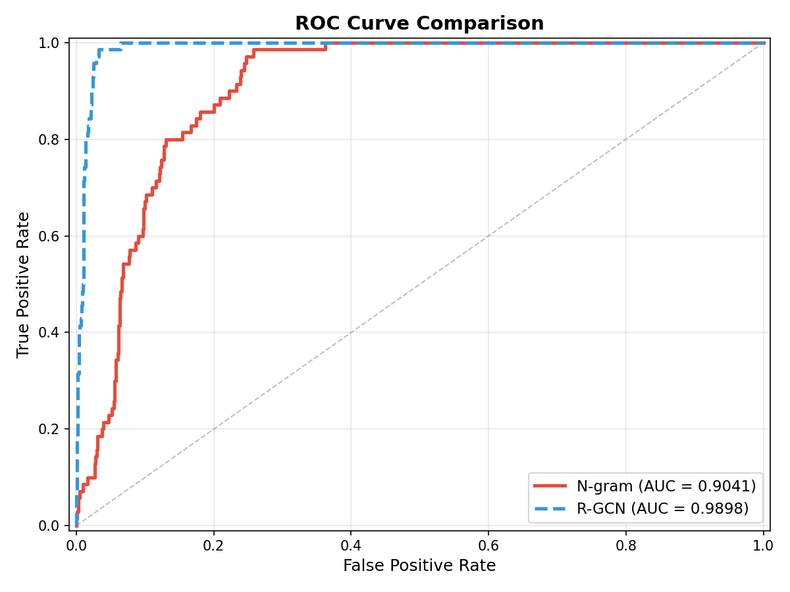

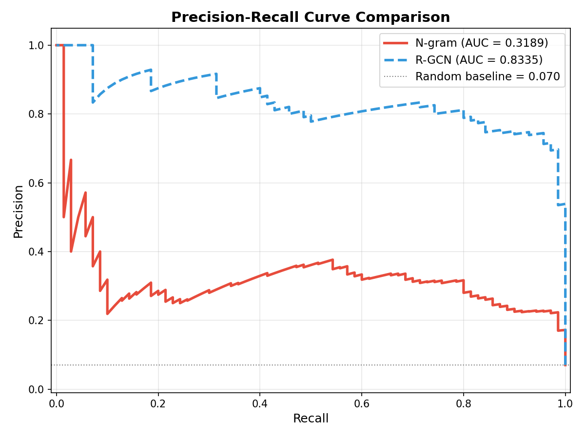

### 5.2 Top-K 排查效果对比

| K | N-gram Precision | R-GCN Precision | N-gram Recall | R-GCN Recall | N-gram 命中 | R-GCN 命中 |
| ---: | ---: | ---: | ---: | ---: | ---: | ---: |
| Top-10 | 0.5000 | 0.9000 | 0.0714 | 0.1286 | 5 | 9 |
| Top-20 | 0.3000 | 0.9000 | 0.0857 | 0.2571 | 6 | 18 |
| Top-30 | 0.2333 | 0.8667 | 0.1000 | 0.3714 | 7 | 26 |
| Top-50 | 0.2800 | 0.8000 | 0.2000 | 0.5714 | 14 | 40 |
| Top-70 | 0.2571 | 0.8000 | 0.2571 | 0.8000 | 18 | 56 |
| Top-100 | 0.3700 | 0.6900 | 0.5286 | 0.9857 | 37 | 69 |

在安全运营场景中，Top-K 指标更接近实际工作流。R-GCN 在 Top-20 中已经命中 18 个恶意用户，而 N-gram 仅命中 6 个；到 Top-100 时，R-GCN 几乎覆盖全部恶意用户，仅漏掉 1 人。

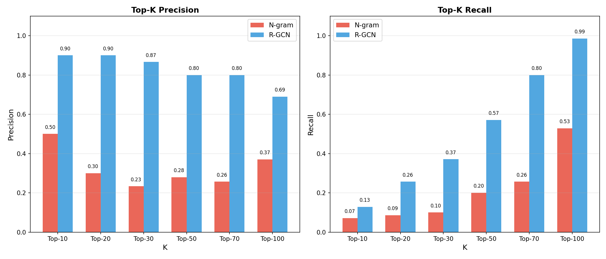

### 5.3 场景级召回对比

| 场景 | 描述 | 用户数 | N-gram Top-70 | R-GCN Top-70 | N-gram Top-100 | R-GCN Top-100 |
| --- | --- | ---: | ---: | ---: | ---: | ---: |
| S1 | USB + Leak 上传 | 30 | 0.3667 | 0.7667 | 0.8333 | 1.0000 |
| S2 | 求职 + 邮件外发 | 30 | 0.0667 | 0.8667 | 0.1667 | 0.9667 |
| S3 | 键盘记录器 | 10 | 0.5000 | 0.7000 | 0.7000 | 1.0000 |

S2 是最能体现两种方法差异的场景。N-gram 方法将 `HTTP_JOBHUNT_WH` 视为低区分度噪声，因此难以从“求职浏览 + 文档访问 + 外发”中稳定识别恶意用户。R-GCN 则利用用户、PC、URL 类别和文件类型之间的结构模式，在 Top-100 中识别出 29/30 个 S2 用户。

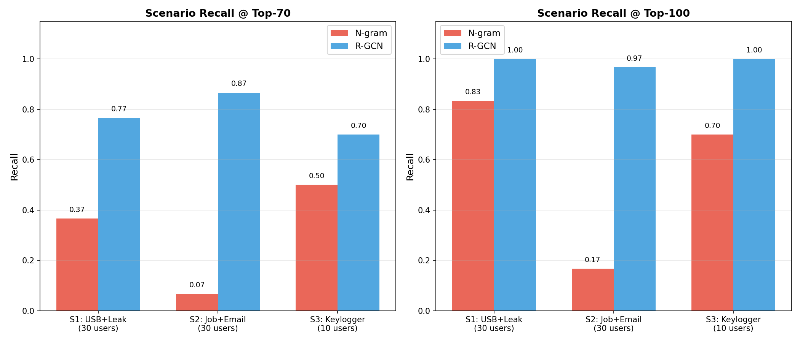

### 5.4 风险分数分布对比

从风险分数分布看，R-GCN 对恶意和良性用户的分离更加明显，高分区域中恶意用户集中度更高；N-gram 分布中存在更多高分良性用户，反映出模板规则对某些高活跃良性用户或类似办公行为存在误报风险。

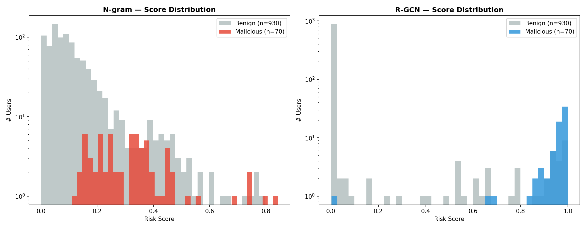

## 6. 结果分析

### 6.1 R-GCN 性能优势来源

R-GCN 方法的优势主要来自三点：

1. **关系结构信息**：用户与 PC、文件类别、URL 类别之间的连接模式可以表达行为上下文，而不仅是行为出现次数。
2. **高阶关联传播**：多个用户共享同类设备、同类 URL 或同类文件操作时，图卷积可以传播群体模式，捕捉规则难以手工定义的结构相似性。
3. **监督信号利用**：R-GCN 显式使用恶意标签进行节点分类训练，而 N-gram 方法主要依赖良性基线和人工模板，对已知恶意标签利用较弱。

R-GCN 对 S2 场景的提升尤其说明，图结构能够弥补单个 token 区分度不足的问题。求职网站访问在良性用户中常见，但若它与特定 PC 使用、文件访问模式、URL 类别组合共同出现，就能形成更强的图结构信号。

### 6.2 N-gram 方法的保留价值

尽管 R-GCN 在数值指标上更优，N-gram 方法仍有重要价值：

1. **解释性强**：可以直接说明用户命中了哪个攻击模板、哪些高风险 token 贡献较高。
2. **冷启动友好**：不依赖大量恶意标签，在真实企业缺少标注时更容易落地。
3. **规则可控**：安全专家可以直接调整模板、威胁权重和阈值。
4. **工程成本低**：不需要图训练框架或 GPU，部署与调试成本较低。

因此，两种方法更适合互补使用：R-GCN 负责高精度排序，N-gram 负责可解释告警与规则审计。

## 7. 方法局限

当前实验仍存在以下限制：

- R-GCN 与 N-gram 的训练协议不同：R-GCN 使用 5-fold OOF 半监督学习，N-gram 使用良性训练基线加全量打分，二者并非完全同等监督强度；
- R-GCN 是 transductive 图学习，对全图已知节点表现优秀，但直接迁移到新用户或新设备需要增量图构建或重新训练；
- 当前 R-GCN 图未纳入 email 关系，可能仍未充分利用 S2 和 S3 中的重要邮件行为；
- R-GCN 将事件聚合为静态图边权，未显式建模攻击链时间顺序；
- N-gram 模板依赖人工设计，对未知攻击链和弱信号组合覆盖不足；
- 两种方法都尚未结合岗位、部门、组织关系和用户个人历史基线进行更细粒度建模。

## 8. 改进方向

后续可以从以下方向继续扩展：

1. **集成模型**：使用 R-GCN 风险分数进行排序，用 N-gram 模板提供解释，形成“高精度 + 可解释”的组合告警。
2. **时序异构图**：将静态 R-GCN 扩展为动态图或 temporal GNN，保留攻击链的先后顺序。
3. **引入邮件图关系**：加入 email address、domain、attachment 等节点和发送关系，加强 S2/S3 检测。
4. **图解释性增强**：引入 GNNExplainer、梯度归因或注意力机制，输出影响单个用户预测的关键子图。
5. **个性化基线**：为每个用户建立历史行为基线，减少高活跃良性用户误报。
6. **自动模板挖掘**：使用 PrefixSpan、GSP 或 SPADE 从恶意/良性序列中自动发现差异化行为模式。
7. **部署评估**：补充推理延迟、内存占用、增量更新成本和告警处置成本等工程指标。

## 9. 结论

本项目在 CMU-CERT r4.2 数据集上完成了基于 N-gram 模板的行为序列匹配方法与基于 R-GCN 的异构图检测方法的实现和对比。实验表明，R-GCN 在检测性能上具有显著优势，尤其能够通过图结构信息提升 S2 弱信号场景的识别能力；N-gram 方法虽然整体指标较低，但具备更好的可解释性、规则可控性和冷启动能力。

从实际系统设计角度看，二者并不是简单替代关系。更合理的部署方案是将 R-GCN 作为用户风险排序主模型，将 N-gram 序列匹配作为解释层和专家规则层：前者提升召回和排序质量，后者帮助安全分析人员理解告警依据。这样的组合能够兼顾检测性能、解释性和运营可用性。

## 附录：复现实验命令

```bash
# 一键完整流水线
python src/run_full_pipeline.py

# 或分步执行
python src/preprocess.py
python src/train_evaluate.py
python src/visualize.py
python src/rgcn/build_graph.py
python src/rgcn/train_rgcn.py --verbose
python src/compare_algorithms.py
```

## 附录：图片索引

| 图片 | 路径 |
| --- | --- |
| N-gram ROC/PR | `outputs/fig_roc_pr.png` |
| N-gram Top-K | `outputs/fig_topk.png` |
| N-gram 风险分布 | `outputs/fig_risk_distribution.png` |
| N-gram Top-30 贡献 | `outputs/fig_top30_contribution.png` |
| N-gram 场景覆盖 | `outputs/fig_scenario_breakdown.png` |
| N-gram 恶意用户排名 | `outputs/fig_malicious_ranks.png` |
| 双算法 ROC 对比 | `outputs/comparison/fig_roc_comparison.png` |
| 双算法 PR 对比 | `outputs/comparison/fig_pr_comparison.png` |
| 双算法 Top-K 对比 | `outputs/comparison/fig_topk_comparison.png` |
| 双算法场景对比 | `outputs/comparison/fig_scenario_comparison.png` |
| 双算法风险分布对比 | `outputs/comparison/fig_score_dist_comparison.png` |
